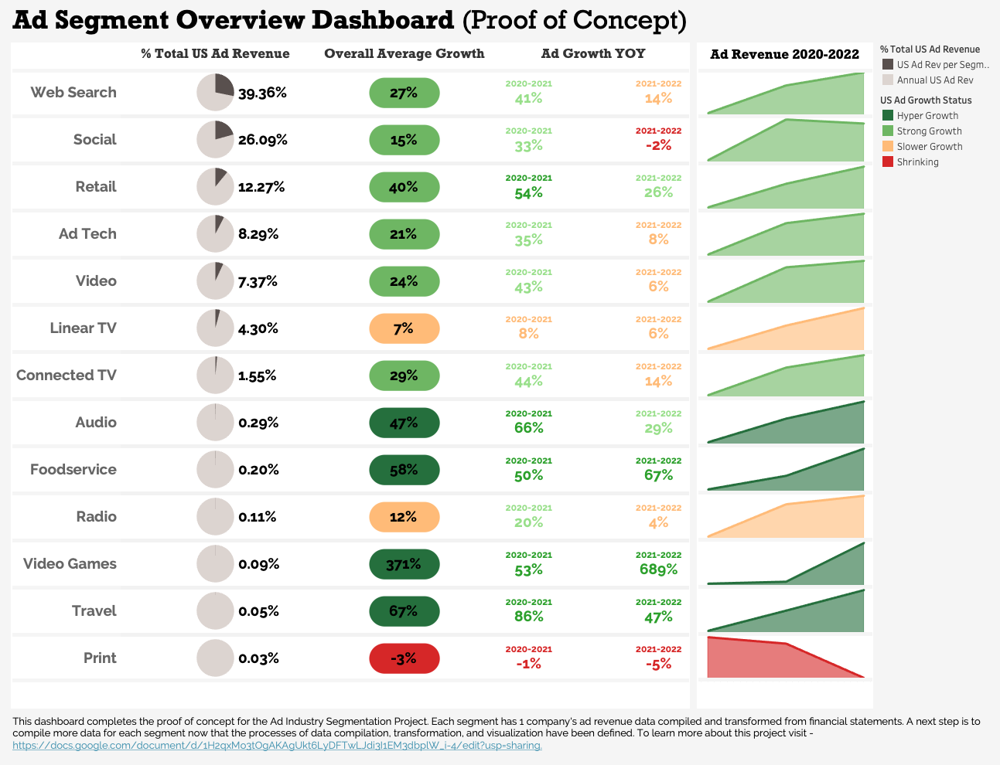

# Advertising-Industry-Analysis

<b>Dashboard for Completed Proof of Concept</b>
* [https://public.tableau.com/app/profile/kevin.gregersen/viz/WIP_MarketingSegmentProjectDashboard/Dashboard1?publish=yes
](https://public.tableau.com/app/profile/kevin.gregersen/viz/AdIndustrySegmentationProject_WIP/AdOverviewDashboardpoc)

<b>Link to the Project Process Documentation</b>
* https://docs.google.com/document/d/1H2qxMo3tOgAKAgUkt6LyDFTwLJdi3I1EM3dbplW_i-4/edit?usp=sharing

<b>Ways of Furthering this Project</b>
<i>Option 1</i>
* Understand where end user/recipient's time and focus is going. Assess, compile and analyze strategies to increase marketing efficiencies. 
>* Ex: Social media, streaming platforms for video & audio compete for users’ time (how is it monetized, what are new or improvements that can be made?)

<i>Option 2</i>
* Complete the data compilation for the segments and add 'Other' segments for Digital & Linear
>* 'Other' for digital would include email & SMS; for Linear would include Out-of-Home.

<i>Option 3</i>
* Dive into how traditional companies (linear & offline) are transitioning to remain relevant 
>* What tools are they using? How may it help others in parallel industries and smaller competitors?
>* Ex: New York Times: print vs digital ads - digital is already 61% of ad revenue. What is NYT offering?
>>* Can lead to comparison of different digital offerings & identification of core drivers/systems for displaying relevant ads.

<i>Option 4</i>
* Compile macroeconomic data over similar time period 
* Complete an analysis on if / how macroeconomic factors are impacting ad revenue across channels

  

